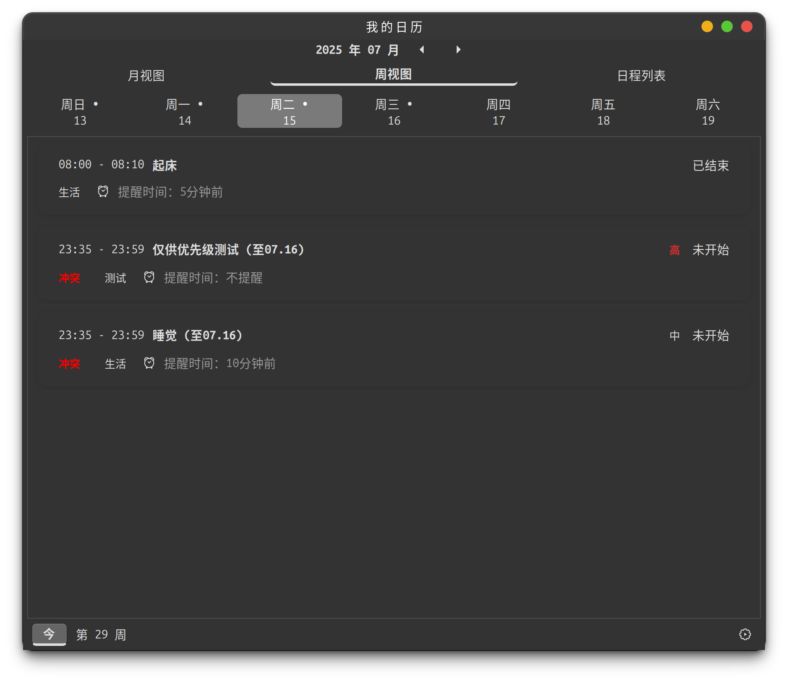

# 日程管理应用设计文档

## 1. 项目概述

本项目是一个基于C++和GTK+的桌面日程管理应用，提供用户管理、任务管理、提醒功能等核心功能。应用支持多种视图模式（月视图、周视图、日程列表），具有完整的用户认证系统和系统托盘集成。

## 2. 小组成员名单

| 姓名 | 学号 | 负责模块 |
|------|------|----------|
| 黄俊艺 | 524031910360 | 前端界面开发、任务管理系统、用户管理系统、数据持久化和文件操作 |
| 王博宇 | 524031910423 | MD5加密模块、密码验证逻辑、后台提醒系统 |

## 3. 分工详细说明

### 3.1 前端界面开发
**负责人：** 黄俊艺

- 设计并实现GTK+用户界面
- 实现月视图、周视图、日程列表视图
- 处理用户交互事件（点击、右键菜单等）
- 实现响应式界面布局和CSS样式

### 3.2 后端业务逻辑
**负责人：** 黄俊艺、王博宇

- 任务管理系统
- 用户管理系统
- MD5加密模块
- 数据持久化和文件操作

### 3.3 后台提醒系统
**负责人：** 王博宇

- 多线程提醒系统设计
- 定时器机制实现
- 跨天任务处理逻辑
- 系统托盘集成

## 4. 部分运行界面截图

### 4.1 对话框设计


### 4.2 主界面 - 月视图


### 4.3 主界面 - 周视图


### 4.4 主界面 - 日程列表


## 5. 模块与类设计

### 5.1 整体架构

```
SchedulerApp
├── GUI层（GTK+ Widgets）
├── 业务逻辑层（TaskManager, UserManager）
├── 数据层（文件存储）
└── 工具层（时间处理、格式化等）
```

### 5.2 核心类设计

#### 5.2.1 SchedulerApp类
- **职责：** 应用程序主类，继承自`Gtk::Application`
- **核心功能：**
  - 窗口管理和界面初始化
  - 用户界面事件处理
  - 视图模式切换（月/周/日程列表）
  - 系统托盘集成

#### 5.2.2 TaskManager类
- **职责：** 任务管理核心类
- **核心功能：**
  - 任务增删改
  - 任务冲突检测
  - 提醒系统管理
  - 数据持久化

#### 5.2.3 UserManager类
- **职责：** 用户管理系统
- **核心功能：**
  - 用户注册/登录
  - 密码验证和修改
  - 用户数据管理

#### 5.2.4 Task结构体
```cpp
struct Task {
    long long id;
    string name;
    time_t startTime;
    int duration;
    Priority priority;
    Category category;
    string customCategory;
    string reminderOption;
    time_t reminderTime;
    bool reminded;
};
```

#### 5.2.5 TaskSegment结构体
```cpp
struct TaskSegment {
    long long id;
    string name;
    time_t original_start;
    time_t original_end;
    time_t display_start;
    time_t display_end;
    Priority priority;
    Category category;
    string customCategory;
    string reminderOption;
    bool is_cross_day;
    bool is_first_segment;
    bool has_conflict;
    bool is_highest_priority_in_conflict;
};
```

### 5.3 枚举定义

#### 5.3.1 Priority枚举
```cpp
enum class Priority {
    HIGH,    // 高优先级
    MEDIUM,  // 中优先级
    LOW      // 低优先级
};
```

#### 5.3.2 Category枚举
```cpp
enum class Category {
    STUDY,        // 学习
    ENTERTAINMENT, // 娱乐
    LIFE,         // 生活
    OTHER         // 其他（自定义）
};
```

#### 5.3.3 ViewMode枚举
```cpp
enum class ViewMode {
    MONTH,   // 月视图
    WEEK,    // 周视图
    AGENDA   // 日程列表
};
```

## 6. 流程图

### 6.1 应用启动流程


### 6.2 用户登录流程


### 6.3 任务管理流程


### 6.4 提醒系统流程


### 6.5 跨天任务处理流程


## 7. 关键技术问题说明

### 7.1 跨天任务处理

**问题描述：** 任务可能跨越多天，需要在不同日期的视图中正确显示。

**解决方案：**
- 使用`TaskSegment`结构体将跨天任务分割成多个片段
- 每个片段记录原始时间和显示时间
- 为跨天任务添加特殊标记（如"续"、"至xx.xx"）

```cpp
// 关键代码示例
if (segment.is_cross_day && !segment.is_first_segment) {
    display_name = segment.name + " (续)";
} else if (segment.is_cross_day && segment.is_first_segment) {
    display_name = segment.name + " (至" + end_date + ")";
}
```

### 7.2 任务冲突检测

**问题描述：** 多个任务时间重叠时需要检测冲突并高亮显示。

**解决方案：**
- 实现`tasks_overlap()`函数检测时间重叠
- 使用`sort_tasks_with_conflicts()`进行冲突感知排序
- 高亮显示冲突任务组中的最高优先级任务

```cpp
// 冲突检测逻辑
bool SchedulerApp::tasks_overlap(const TaskSegment &task1, const TaskSegment &task2) {
    return task1.display_start < task2.display_end && 
           task1.display_end > task2.display_start;
}
```

### 7.3 多线程提醒系统

**问题描述：** 提醒功能需要在后台独立运行，不能阻塞主界面。

**解决方案：**
- 使用独立线程运行提醒检查
- 通过`Glib::signal_idle()`将提醒回调传递到主线程
- 确保线程安全的数据访问

```cpp
// 提醒回调示例
m_task_manager.setReminderCallback([this](const string &title, const string &msg) {
    Glib::signal_idle().connect_once([this, title, msg]() {
        this->show_message(title, msg);
        this->update_all_views();
    });
});
```

### 7.4 系统托盘集成

**问题描述：** 应用关闭后需要在系统托盘中保持运行。

**解决方案：**
- 使用`libayatana-appindicator`库实现系统托盘
- 区分"关闭到托盘"和"完全退出"
- 提供托盘菜单支持显示/隐藏窗口

```cpp
// 托盘设置示例
indicator_ = app_indicator_new(
    "scheduler-app",
    "indicator-messages",
    APP_INDICATOR_CATEGORY_APPLICATION_STATUS);
```

### 7.5 数据持久化

**问题描述：** 用户数据和任务数据需要持久化存储。

**解决方案：**
- 使用文件系统进行数据存储
- 实现增量更新机制
- 确保数据一致性和完整性

### 7.6 时间处理与格式化

**问题描述：** 需要处理各种时间格式转换和本地化显示。

**解决方案：**
- 统一使用`time_t`作为内部时间表示
- 实现多种时间格式化函数
- 支持跨时区的时间处理

```cpp
// 时间格式化示例
string time_t_to_datetime_string(time_t time) {
    if (time == 0) return "N/A";
    char buffer[20];
    strftime(buffer, sizeof(buffer), "%Y-%m-%d %H:%M", localtime(&time));
    return buffer;
}
```

### 7.7 内存管理

**问题描述：** GTK+应用需要正确管理控件内存。

**解决方案：**
- 使用`Gtk::make_managed()`创建控件
- 利用GTK+的自动内存管理机制
- 避免手动delete GTK+控件

### 7.8 事件处理优化

**问题描述：** 复杂的用户交互需要高效的事件处理。

**解决方案：**
- 使用信号连接阻塞/解除阻塞避免递归调用
- 实现右键菜单的上下文感知
- 优化界面更新频率

## 8. 编译和运行环境

### 8.1 依赖库
- GTK+ 3.0
- libayatana-appindicator
- C++17 标准库

### 8.2 编译要求
- GCC 7.0+ 或 Clang 5.0+
- CMake 3.10+
- Linux 环境（推荐Ubuntu 18.04+）

### 8.3 文件结构
```
SchedulerApp/
├── src/
│   ├── SchedulerApp.cpp
│   ├── SchedulerApp.h
│   ├── TaskManager.cpp
│   ├── TaskManager.h
│   ├── UserManager.cpp
│   └── UserManager.h
├── GUIDesign.xml
├── CMakeLists.txt
├── 设计文档.
└── README.md
```

## 9. 总结

本日程管理应用通过模块化设计和现代C++技术，实现了完整的桌面日程管理功能。关键创新点包括跨天任务处理、智能冲突检测、多线程提醒系统等。应用具有良好的用户体验和系统集成能力，可以满足日常办公和学习的日程管理需求。
